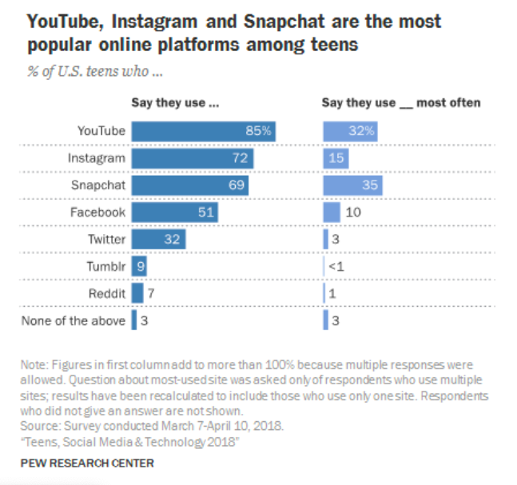
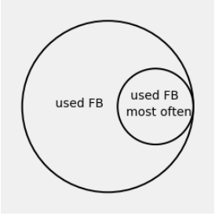

---
redirect_from:
  - "/notebooks/chapter-01/01-probabilities-as-proportions"
interact_link: content/notebooks/Chapter_01/01_Probabilities_as_Proportions.ipynb
kernel_name: python3
has_widgets: false
title: 'Probabilities as Proportions'
prev_page:
  url: /notebooks/Chapter_01/00_The_Basics.html
  title: 'The Basics'
next_page:
  url: /notebooks/Chapter_01/02_Exact_Calculation_or_Bound.html
  title: 'Exact Calculation or Bound'
comment: "***PROGRAMMATICALLY GENERATED, DO NOT EDIT. SEE ORIGINAL FILES IN /content***"
---

## Probabilities as Proportions

You can think of probability as a numerical measure of uncertainty. Exactly what this means is the subject of considerable philosophical debate which we will touch on from time to time. For now, it is reassuring to note that almost all sides in the debate agree on some basic computational principles. Indeed, these principles have been known to gamblers through the ages.

To state the principles it helps to have some terminology and notation. In this section we'll just set these up informally and get a taste of some of the considerations that are involved in calculating chances. In later sections we will work more formally and in greater generality.

### Terminology

An *experiment* is any activity that involves an element of chance. When you perform the experiment there is an *outcome* which is the result of the experiment. 

Thus for example rolling a six-sided die once is an experiment. You can think of the outcome as an integer in the range 1 through 6, corresponding to the number of spots on the face of the die that appears on the roll.

An *event* is a description of the result of the experiment, which could be more broad than just a single outcome. For example, "the die shows a multiple of 3" is an event. This event happens if the die shows either 3 or 6.

**Language note:** The word *die* is singular. The word *dice* is the plural of *die*. You can have one die or two dice. But you cannot have one dice. 

### Assumption of Equally Likely Outcomes

Here's a question for you:

What is the chance that the die shows a multiple of 3? 

Did you answer, "2 out of 6, or 1/3, because it's two faces out of six faces"?

If you did, pause for a second and examine what you hid in that answer. Notice that **you assumed that all six faces have the same chance, and that the chance is just a simple proportion.**

That's a fine way to start, but it is important always to be aware that **probabilities depend on the assumptions that have been made, and if the assumptions are wrong then the answers can't be trusted**. 

After all, you haven't seen the die. It might be a trick die that is loaded in some way to show some faces more often than others.

But for now let's assume that the die is fair. That is, we will assume that all six faces are equally likely to appear on the roll. In this class, the word "die" used without any qualification will mean "fair six-sided die". 

### Proportions
Gamblers through the ages would agree with your calculation of "2 out of 6" for the chance that the die shows an even number, assuming that the die is fair.

In general, *if an experiment has a finite number of equally likely outcomes,* then the probability of an event is defined as *the proportion of outcomes that are included in the event*.

No matter whether the die is fair or loaded, the event "the die shows a multiple of 3" consists of two outcomes: 3 and 6. If the die is fair then the probability of the event is the proportion 2/6 by the definition above.

We will usually shorten this to $P(\text{die shows a multiple of 3}) = 2/6$. That's $P$ for probability, of course.

You are welcome to write the answer as "2 out of 6" or "1/3" or "33.333...%" or "0.333..." or any equivalent way of representing the proportion.

### Teen Use of Online Platforms
Coins, dice, cards, and other games of chance provide wonderful examples that illuminate properties of probability. We will use them frequently for that purpose. But data scientists typically work in other settings. Ideas developed in the context of games of chance can be translated, with appropriate care, into those settings to help data scientists gain insights about the data.

The [Pew Research Center](https://www.pewresearch.org/) is an organization that conducts surveys on the opinions and choices of people in the U.S. In Spring 2018 it [surveyed U.S. teens](https://www.pewinternet.org/2018/05/31/teens-social-media-technology-2018/) (ages 13 through 17) about their use of online platforms such as YouTube and Facebook.

The graphic below displays some of the results of the survey. For now, set aside questions about the accuracy of the survey across the U.S; we will discuss sampling accuracy later in the course. Just consider a population of teens whose online platform usage is summarized by these graphs.

There are two bar charts. Each displays percents of teens over categories that are online platforms. Note "None of the above" as the category at the bottom of both. The teens in those bars are the same in both charts and constitute 3% of all the teens.

### Distribution
Though the two bar charts cover the same categories, there is an important difference between them. Read the Note that the Pew Research Center included below the graphs.

The chart on the right displays the answer to a question that asked which *one* of the platforms was most commonly used by the teen respondent. Each teen picked one and only one such platform. *Thus each teen is represented in exactly one of the bars.* For example, the group that said they used Facebook most often has no members in common with the group that said they used Twitter most often.

That is why the percents in the bars of the right hand chart add up to 100 (apart from rounding). We say that the chart represents a *distribution* of teens over the categories. In a distribution, each individual appears in one and only one category.

In the chart on the left, teens can appear in more than one category because they were identifying which platforms they used and were allowed to list more than one. Because the groups in the different categories overlap, the percents add up to more than 100. This bar chart does not represent a distribution.

### Complements
Now assume you are picking one teen at random from the population represented in these charts. That is short for assuming that each teen has the same chance of being picked as every other teen in the population.

Because all the outcomes (teens!) are equally likely, probabilities are just percents of teens. Let's use the charts to find some chances.

**Question 1:** What is the chance that the chosen teen used Facebook most often? 

**Answer:** This can be read off the right hand chart: $P(\text{used Facebook most often}) ~ = ~ 0.1$

**Question 2:** What is the chance that the chosen teen did not use Facebook most often? 

**Answer:** The group that did not use Facebook most often consists of everyone but those who used Facebook most often. In the language of set theory, these two groups are called *complements* of each other. Their two proportions must add up to 1. So: $P(\text{did not use Facebook most often}) ~ = ~ 1 - 0.1 ~ = ~ 0.9$

**Question 3:** What is the chance that the student used Facebook but used some other platform more often?

**Answer:** Now we have to use the information in both graphs. The left hand graph says that 51% of the teens used Facebook. We already saw that 10% of the teens used Facebook most often. *This group used Facebook*, so it is part of the 51% that used Facebook.

Who were the other 41%? That's right – they used Facebook, but not most often. That's exactly the group whose proportion we are trying to find. It can be thought of as the complement of those who used Facebook most often *but only among those who used Facebook*.

In summary, 

$$
\begin{align*}
& P(\text{used Facebook but used some other platform more often}) \\
&= ~ 0.51 - 0.1 ~ = ~ 0.41
\end{align*}
$$

### Conditioning
Probabilities of events can be affected by information about the occurrence of other events. For example, suppose as before that someone picks a teen at random from the population represented in the charts. And now suppose that they tell you that the teen used Facebook.

**Question 4:** Given this information, what is the chance that the teen used Facebook most often?

**Answer:** Go back and look at the left hand chart. You know that the selected teen is in the Facebook bar of the chart. So you can forget all the other bars. *You are now working with a restricted set of outcomes:* the outcomes corresponding to the given information, which is that the teen used Facebook.

The teens who used Facebook most often are a subset of this group, as observed earlier and shown in the figure below. It's just a rough Venn diagram that uses circles instead of bars. We'll be sketching a lot of these, and you should too.

The total number of outcomes is now the "used FB" group, which comprises 51% of the original total number of teens. If you prefer counts to percents, you can pretend that there were 100 teens in all, and that thus there were 51 teens who used Facebook. 

The right hand chart says that the teens who used Facebook most often are 10% of the entire population, that is, 10 out of 100 imagined teens.

We can now put all these observations together to find the chance in question. Given that the selected teen used Facebook, the chance that they used Facebook most often is

$$
\frac{\text{10% of original total}}{\text{51% of original total}} ~ = ~ \frac{0.1}{0.51} ~ = ~ \frac{10}{51} ~ \approx ~ 0.196 
$$

This is called the *conditional probability that the teen used Facebook most often, given that they used Facebook*. That's pretty long, so some notation is helpful. This conditional probability is written as

$$
P(\text{used Facebook most often} \mid \text{used Facebook})
$$

The vertical bar is read as "given that". 

To find a conditional probability:

- First restrict the set of all outcomes as well as the event to only the outcomes that satisfy the given condition
- Then calculate proportions accordingly

Compare the answers to Questions 1 and 4 to see how additional information about the outcome affects the probability of an event.

- $P(\text{used Facebook most often}) = 0.1$
- $P(\text{used Facebook most often} \mid \text{used Facebook}) \approx 0.196 \approx 0.2$

The second answer is about double the first. 

The answer to Question 1 is 10% (out of the original population). The answer to Question 4 is that same 10% relative to about half of the original population, because about half the original population used Facebook. That makes the answer to Question 4 about double the answer to Question 1.

The probability of "used Facebook most often" changes based on the given information, because knowing that the selected teen used Facebook restricts the possible outcomes to about half of the original population.

