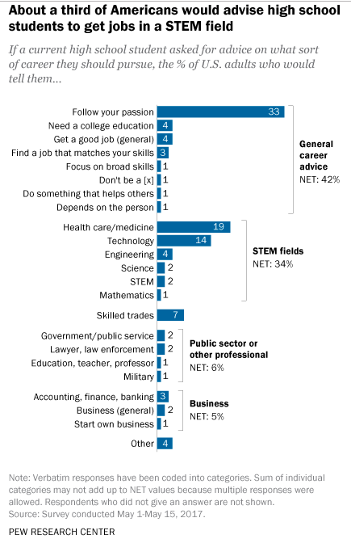

---
redirect_from:
  - "/notebooks/chapter-01/04-exercises"
interact_link: content/notebooks/Chapter_01/04_Exercises.ipynb
kernel_name: python3
has_widgets: false
title: 'Exercises'
prev_page:
  url: /notebooks/Chapter_01/03_Fundamental_Rules.html
  title: 'Fundamental Rules'
next_page:
  url: 
  title: ''
comment: "***PROGRAMMATICALLY GENERATED, DO NOT EDIT. SEE ORIGINAL FILES IN /content***"
---


<div markdown="1" class="cell code_cell">
<div class="input_area" markdown="1">
```python
# HIDDEN
from datascience import *
from prob140 import *
%matplotlib inline
import matplotlib.pyplot as plt
plt.style.use('fivethirtyeight')
import numpy as np

```
</div>

</div>


## Exercises


**1)** In 2017, a Pew Research Center survey asked a random sample of American adults an open-ended question: "If a current high school student asked you for advice on what sort of career they should pursue, what would you tell them?" Here adults are defined as people aged 18 or more.

The Center's [report](http://pewrsr.ch/2xyIAAW) provides the following summary of the responses.



Assume that the percents in the chart were accurate for the US adult population in 2017.

**a)** Read the Note at the bottom of the chart and explain what you think the word NET means in this context.

**b)** If a US adult was picked at random in 2017, what is the chance that they would not advise STEM fields?

**c)** Suppose a US adult was picked at random in 2017. Given that this person gave general career advice, what is the chance that the advice was to follow one's passion?

**d)** Though the chart doesn't show this, the researchers also looked at the advice by age. Which group do you think was larger: those aged 18-29, or those aged at least 30? Why?

**e)** The chart shows that 34% of adults advised going into STEM fields. The report also notes that "adults aged 30 and older are more likely than those younger than 30 to to promote the virtues of STEM fields (36% versus 23%)." Do these numbers confirm or contradict your answer to Part (d)? Why?


**2)** Ashley, Francie, and Rohan arrive for a meeting in random order. This means that if you let A, F, and R represent Ashley, Francie, and Rohan respectively, then all six of the possible orderings AFR, ARF, FAR, FRA, RAF, and RFA have the same chance. These orderings are also known as *permutations* of the letters A, F, and R.

**a)** For each event below, write the subset of permutations and find the chance of the event. What is the relation between the chances?

- A_1: Ashley arrives first

- A_2: Ashley arrives second

- A_3: Ashley arrives third

**b)** What is the chance that Rohan arrives before Francie?

**c)** Say whether the following statement is true or false. If it is true, explain why. If it is false, find the correct value of the left hand side.

$P(\text{Francie arrives before Rohan or Ashley}) ~ = ~ P(\text{Francie arrives before Rohan}) + P(\text{Francie arrives before Ashley})$


**3)** In the grade distribution of a class, an equal proportion of students got A's and B's and the remaining students got C's. You can assume that there was at least one student in each grade category.

One student is picked at random from this class.

**a)** If possible, find the numerical value of the chance that the selected student got an A. If this is not possible, explain why not.

**b)** If possible, find the numerical value of the chance that the selected student got an A given that the student got an A or a B. If this is not possible, explain why not. 

**c)** If possible say which one of the following chances is larger than the other. If this is not possible, explain why not.

- the chance that the student got an A
- the chance that the student got an A given that the student did not get a B


**4)** The 17th century French writer who called himself the Chevalier de Méré was interested in probability and claimed that two events involving dice have the same chance. In this exercise you will assess his calculations.

Note that on a die, the "ace" is the face with one spot.

**a)** The Chevalier said that the chance of getting at least one ace in four rolls of a die is 2/3. His reasoning was that the chance of getting an ace on one roll is 1/6, so the chance of getting an ace in at least one of four rolls is $4 \times (1/6) = 4/6 = 2/3$. 

Is this a good argument? If not, what is the flaw? If it is flawed, is the Chevalier's answer too large or is it too small?

**b)** The Chevalier also said that the chance of getting at least one double-ace in 24 rolls of a pair of dice is 2/3. He reasoned that the chance of getting a double-ace in one roll of a pair of dice is 1/36, which is true. He went on to say that therefore the chance of at least one double-ace in 24 rolls of a pair of dice is $24 \times (1/36) = 24/36 = 2/3$.

Is this a good argument? If not, what is the flaw? If it is flawed, is the Chevalier's answer too large or is it too small?

[In fairness to the Chevalier, he observed that when dice were actually rolled, the events in Parts **a** and **b** did not occur equally often. He got the great mathematicians Pascal and Fermat to help him fix his error. You will do their work in the next chapter.]


**5)** Here's a [question from Quora](https://www.quora.com/If-a-student-applies-to-ten-colleges-with-a-20-chance-of-being-accepted-to-each-what-are-the-chances-he-will-be-accepted-by-at-least-one-college): "If a student applies to ten colleges with a 20% chance of being accepted to each, what are the chances that he will be accepted by at least one college?"

Without making any further assumptions, what can you say about this chance?

