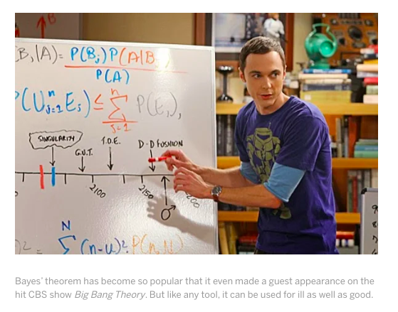

---
redirect_from:
  - "/notebooks/chapter-02/00-intersections-and-conditioning"
interact_link: content/notebooks/Chapter_02/00_Intersections_and_Conditioning.ipynb
kernel_name: python3
has_widgets: false
title: 'Intersections and Conditioning'
prev_page:
  url: /notebooks/Chapter_01/04_Exercises.html
  title: 'Exercises'
next_page:
  url: /notebooks/Chapter_02/01_The_Chance_of_an_Intersection.html
  title: 'The Chance of an Intersection'
comment: "***PROGRAMMATICALLY GENERATED, DO NOT EDIT. SEE ORIGINAL FILES IN /content***"
---

# Intersections and Conditioning

The main axiom of probability specifies the chance of the union of mutually exclusive events. As you have seen, when events are not mutually exclusive we have to understand their overlap or *intersection* in order to find the chance of the union.

Probabilists and data scientists are often interested in chances of intersections. The chance that we lose all our bets, or that a randomly picked person is at risk for a disease and doesn't have health insurance, are just two examples. So when it comes to intersections, probabilists have shortened even the standard notation of set theory.

In the figure below, the deeper blue region is the event $A \cap B$, the intersection of the events $A$ and $B$. It consists of the outcomes that are in $A$ as well as in $B$. We are too lazy to write the $\cap$ and just denote the intersection $AB$. Keep in mind that this does *not* denote a product of the two events.

In this chapter we will see how to find the chance of an intersection of events and hence also of a union of overlapping events. In doing so we will give a general definition of conditional probability and see how the probability of an event changes based on information related to the event.

Bayes' Rule is the data scientist's fundamental method of updating probabilities based on new information. We will end this chapter with Bayes' Rule and some of its implications. For now, just enjoy a [Scientific American blog post](https://blogs.scientificamerican.com/cross-check/bayes-s-theorem-what-s-the-big-deal/) about what Bayes' Rule can do. Or at least just look at the picture that it starts out with: Sheldon of the Big Bang Theory has written Bayes' Rule at the top of the board, just above another probability fact that you will recognize.

