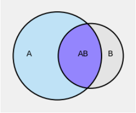
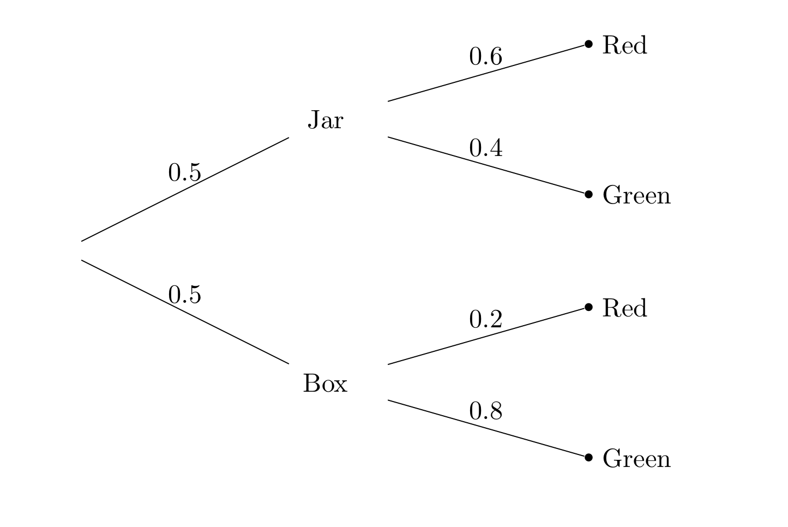

---
redirect_from:
  - "/notebooks/chapter-02/03-bayes-rule"
interact_link: content/notebooks/Chapter_02/03_Bayes_Rule.ipynb
kernel_name: python3
has_widgets: false
title: 'Bayes Rule'
prev_page:
  url: /notebooks/Chapter_02/02_Symmetry_in_Simple_Random_Sampling.html
  title: 'Symmetry in Simple Random Sampling'
next_page:
  url: /notebooks/Chapter_02/04_Use_and_Interpretation.html
  title: 'Use and Interpretation'
comment: "***PROGRAMMATICALLY GENERATED, DO NOT EDIT. SEE ORIGINAL FILES IN /content***"
---

## Bayes' Rule

Thus far, we have used the multiplication rule $P(AB) = P(A)P(B \mid A)$ only in settings where the conditional probability $P(B \mid A)$ is clear as the proportion of outcomes that are in $B$ among only the outcomes that are in $A$. 

The general definition of conditional probability, regardless of setting, is just a rearrangement of the multiplication rule.

### Conditional Probability (Division Rule)
Let $A$ and $B$ be two events and let $P(A) > 0$. The *conditional probability of $B$ given $A$* is defined as

$$
P(B \mid A) ~ = ~ \frac{P(AB)}{P(A)}
$$

It makes sense to assume $P(A) > 0$, not just because $P(A)$ appears in the denominator but also because if $P(A)$ were 0 then we could not be given the condition that $A$ occurred.

In the figure below, think of the grey rectangle as the whole space $\Omega$. The unconditional chances $P(A)$ and $P(B)$ are the areas of the corresponding circles relative to the area of the grey rectangle. 

But once we are given that $A$ occurred, the outcome space is restricted to $A$. Under this condition, the only way $B$ can occur is if the outcome is in the intersection $AB$. 

Therefore, given that $A$ has occurred, the conditional chance of $B$ is the area of the overlap $AB$ relative to the area of $A$. That's what the definition is saying.

You have seen many examples where you have quite naturally written down conditional probabilities without using the division rule. In these examples, an experiment had several stages (for example, cards were being dealt one by one) and you were working with conditional probabilities of events at later stages given the results of earlier stages. 

The division rule helps when the conditioning makes you go backwards in time, for example by giving you the result of a later stage and asking your opinion about what might have happened earlier. 

Let's start with a simple example.

### A Random Container
I have two containers: a jar and a box. Each container has five balls.

- The jar contains three red balls and two green balls.
- The box contains one red ball and four green balls.

I pick a container at random and then a ball at random from that container. Given that the ball is red, what is the chance I picked the box?

At a glance, you should guess that the answer is less than half. Given that the ball is red, you should be leaning towards guessing that I picked the jar because it has a higher proportion of red balls than the box does.

To make this intuition precise, it helps to visualize the details of the experiment in a *tree diagram*.

The first level of the tree corresponds to the first stage of the experiment, that is, picking the box. The second level corresponds to picking the ball once the box has been picked. 

The numbers on the branches are probabilities. Let $J$ be the event that I picked the jar and let $B$ be the event that I picked the box. Let $R$ be the event that the selected ball is red and let $G$ be the event that it is green. The probabilities displayed in the figure are:

- $P(J) = 0.5 = P(B)$
- $P(R \mid J) = 0.6$, $P(G \mid J) = 1 - P(R \mid J)$ = 0.4
- $P(R \mid B) = 0.2$, $P(G \mid B) = 1 - P(R \mid B)$ = 0.8

The four conditional probabilities in the display are all "forwards in time" probabilities: conditional chances for the second stage of the experiment given the result of the first stage. They can be written down directly.

But our problem is to find $P(B \mid R)$, the conditional chance of drawing the box in the first stage given that the result of the second stage is Red. 

The given condition is that the outcome is on one of the two branches that end in red: $JR$ or $BR$. The probability that we want is the conditional chance that the outcome is actually on the lower of the two branches: $BR$.

The division rules helps us find this chance.

$$
P(B \mid R) ~ = ~ \frac{P(BR)}{P(R)} ~ = ~ \frac{0.5 \times 0.2}{(0.5 \times 0.6) + (0.5 \times 0.2)} ~ = ~ 0.25
$$

The answer is less than half, just as you had guessed. 

We have updated our opinion about whether the box was drawn, given the color of the ball. 

- Before we knew the color of the ball, we said the chance of drawing the box is 0.5. This is called the *prior* probability of drawing the box.
- After we saw that the ball is red, we said that the chance that the box was drawn is 0.25. This is called the *posterior* probability of drawing the box.

This way of updating probabilities based on new information is the basis for much inference in data science.

### Bayes' Rule
The calculation we just did is a special case of a result developed by [Reverend Thomas Bayes](https://en.wikipedia.org/wiki/Thomas_Bayes). It says that if $A$ and $B$ are two events and we already know $P(A)$, $P(B \mid A)$, and $P(B \mid A^c)$, then we can find $P(A \mid B)$ as

$$
P(A \mid B) ~ = ~ \frac{P(AB)}{P(B)} ~ = ~ \frac{P(A)P(B \mid A)}{P(A)P(B \mid A) + P(A^c)P(B \mid A^c)}
$$

This is just the division rule in a particular scenario, which is why the division rule is itself sometimes called Bayes' Rule. 

The rule helps you find a *posterior probability:* a conditional chance for the first stage, given the result of a second stage. The calculation has two ingredients: 

- probabilities for the first stage; these are called *prior* probabilities
- conditional probabilities for the second stage given the first; these are called *likelihoods*

The calculation in Bayes' Rule is best remembered in terms of the tree diagram: the total chance of the braches you want relative to the total chance of all the branches that satisfy the given condition. The formula has a way of making this simple idea look harder.

