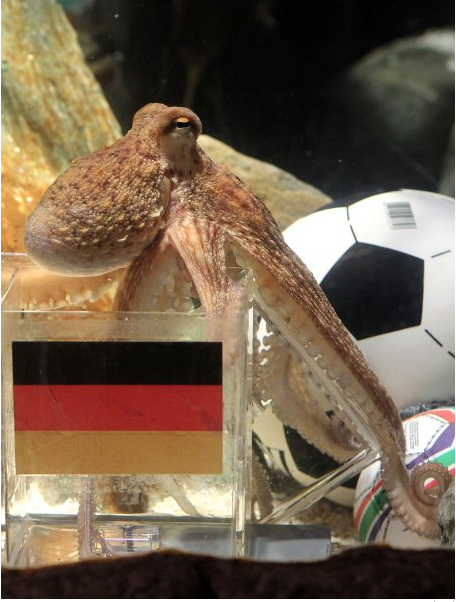

---
redirect_from:
  - "/notebooks/chapter-03/01-success-and-failure"
interact_link: content/notebooks/Chapter_03/01_Success_and_Failure.ipynb
kernel_name: python3
has_widgets: false
title: 'Success and Failure'
prev_page:
  url: /notebooks/Chapter_03/00_Random_Counts.html
  title: 'Random Counts'
next_page:
  url: 
  title: ''
comment: "***PROGRAMMATICALLY GENERATED, DO NOT EDIT. SEE ORIGINAL FILES IN /content***"
---

## Success and Failure

In experiments that involve drawing at random, it is common to label the draws as "trials". For most of this chapter, we will consider experiments in which the result of each trial is in one of a fixed set of categories. For example, in tosses of a coin the categories are usually heads and tails. In cards dealt from a deck, the categories could be the four suits.

When we count outcomes in a particular category, the category that is being counted is often called a "success". When used in this sense, the word "success" does not have to connote any kind of desirability other than being counted. For example, if you were interested in the number of rotten apples in a random collection of fruit, then it would be natural to label the rotten apples as the successes.

Any outcome that is not a success is called a failure.

To start out, we will look at some random counts and see if they are surprising.

### Paul the Octopus
During the 2010 FIFA World Cup, an octopus in a Sea Life Center in Germany became an international sensation by correctly predicting the results of all of Germany's group stage matches, quarter-final and semi-final matches as well as the third-place match (Germany lost the semi-final). Paul also correctly predicted the result of the final, which was won by Spain.

For each prediction Paul was given two clear plastic boxes, each containing a treat. Each box was marked with the flag of one of the teams. Paul's prediction was the country whose flag was on the box he opened to consume the treat within. Here is Paul in a photograph from [Der Speigel](https://www.spiegel.de/fotostrecke/photo-gallery-remembering-paul-the-octopus-fotostrecke-60919.html), with his tentacles inside the Germany box.

The world had great fun with [Paul's predictions](https://en.wikipedia.org/wiki/Paul_the_Octopus) and some people even took them rather seriously. When Paul predicted that Spain would beat Germany in their semi-final, German fans suggested that he be eaten while the Spanish government offered him refuge. The [President of Iran](https://www.telegraph.co.uk/news/worldnews/europe/germany/7912418/Mahmoud-Ahmadinejad-attacks-Octopus-Paul.html) called him a symbol of what was wrong with the Western world.

Statisticians, of course, looked at the probability of making all these predictions just by tossing a coin. Paul made eight correct predictions in the 2010 World Cup. Suppose instead that each time someone picked at random from the two countries playing the match, independently of all other choices. Then what would be the chance that all eight of their choices would be winners?

Here it is natural to call each individual selection a trial. Success occurs if the chosen country wins the match. No matter which country wins, the chance of picking that country is 1/2. So, by the independence of the choices, the chance of picking all eight winners is $(1/2)^8 = 1/256$. 

That's pretty small. Paul did something unusual.

### More Soothsayers

Paul wasn't the only creature predicting soccer results. In Singapore, [Mani the Parakeet](https://en.wikipedia.org/wiki/Mani_the_parakeet) made almost as many correct predictions. Here is Mani with his owner, from a piece in the [Guardian UK](https://www.theguardian.com/football/2010/jul/09/pulpo-paul-mani-psychic-parakeet), picking up a card that appears to show the flag of the Netherlands.

[Other creatures](https://en.wikipedia.org/wiki/Paul_the_Octopus) that were engaged in soccer divination included Leon the porcupine and Petty the pygmy hippopotamus, to name just two.

These other soothsayers didn't do as well as Paul. This raises another question. If numerous creatures are engaged in prediction, what is the chance that at least one of them would get all eight predictions correct just by chance?

Suppose 200 creatures are independently predicting the result of all eight games, and suppose their method was probabilistically equivalent to guessing at random. The number 200 comes from the fact that there are about 200 countries in the world and we are imagining one creature per country. You can use any other large number that you want. Just adjust the calculation below accordingly.

To find the chance that at least one of them predicts all eight games correctly, we have to choose appropriate definitions of "trial" and "success".

- Now a trial is one creature predicting the results of eight matches. There are 200 trials, all independent of each other.
- Success is a creature getting all eight predictions right by guessing at random. This chance is $1/256$.

The chance that at least one creature gets all eight predictions right is therefore the chance of at least one success, which by the complement rule works out to

$$
P(\text{at least one success}) ~ = ~ 1 - (1 - \frac{1}{256})^{200} ~ \approx ~ 54.3\%
$$

Even though the chance of any single creature getting all eight predictions right by pure chance is small, if 200 creatures guess at random then it is more likely than not that at least one of them will do as well as Paul did.

